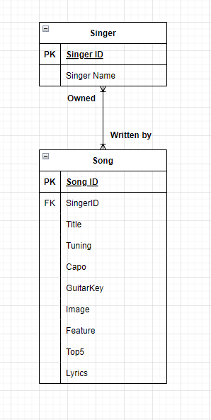
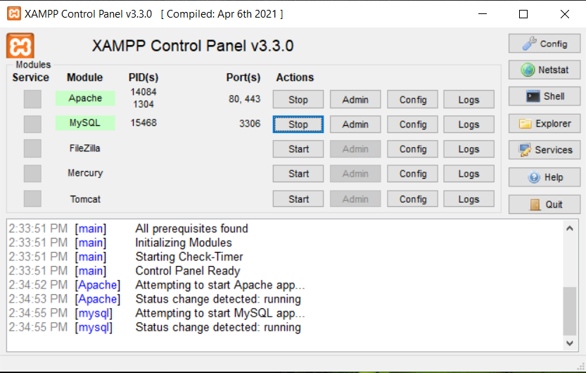
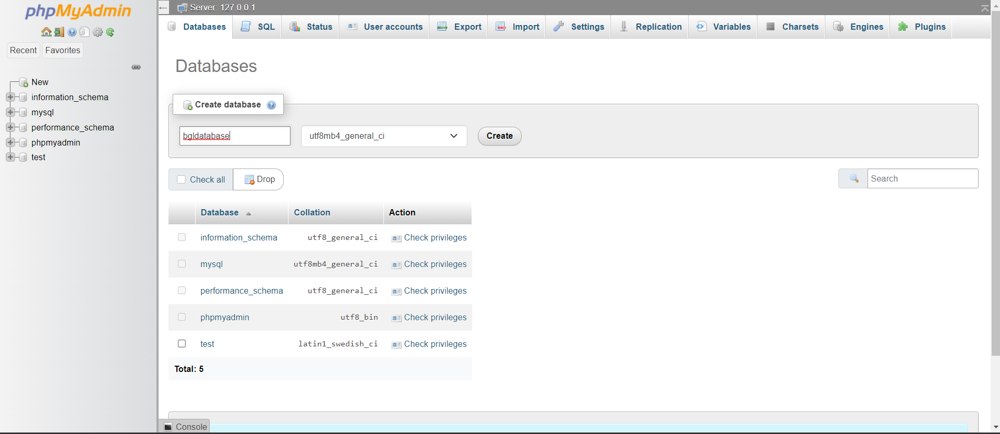

# basic_guitar_learning

## Project description

This “Basic Guitar Learning” website will act as a platform for guitarist from various range of experience and skills to learn basic skills and material of guitar that will bring them to the next level. 
It is also a way to encourage new players to learn how to play a guitar as easy as possible with the self-taught learning to enjoy music in a new way.

## Motivation

Music has been a way for people to communicate and express their emotion. In the current era, the convenience of the internet allows people to access any information and learn new things and we want to contribute some material related to music. As we know, guitar is one of the well-known of its unique and relaxing sound and popularity in the internet. This 6-stringed instrument is very easy to be learned for a novice player and will get more challenging to the advanced player. We hope that by providing some basic guitar material (guitar chords for song and its shapes), guitarists can teach themselves how to play guitar and the chords to start their own journey, and allows them to express their emotion with music.

## Function

By providing lyrics and chords of songs, any level of guitarist can learn to play the song on their guitar. This self-learning method will allow players to learn the song they want with their own pace and style. From the chord table page, not only the user can search for the chord that they needed to play the song, the user also able to discover other new chord that they are not familiar with and learn how to play different chord.

## ER diagram



## Installation guide

### This guide is based on Windows with XAMPP and Git Bash

1. Download [XAPMM](https://www.apachefriends.org/) and install it on your device.

2. Download [Git](https://git-scm.com/download/win) and install it on your device.

3. Run `Git Bash` on your device and ```cd to/xampp/htdocs/folder```

4. Run ```git clone https://github.com/zhouheping239/basic_guitar_learning.git ```

5. Now run XAMPP application and click start on Apache and MySQL

    1. 

6. Go to the browser [https://localhost/phpmyadmin/index.php](https://localhost/phpmyadmin/index.php)

7. Click on Databases and create bgldatabase (need to be the same specific name)

    1. 

8. After create bgldatabase then import .sql file from repo ` basic_guitar_learning/src/guitar/sql/bgldatabase.sql `

9. Now you will be able to access the [https://localhost/basic_guitar_learning/src/guitar/main.php](https://localhost/basic_guitar_learning/src/guitar/main.php)

## User manual

1. The main page will be open as the user open the website. From the main page, user may choose some recommend song that are easy to play. Beside that the user also be able to choose the top 5 songs which we provided.

2. To access all of the song that provided, user can click "Song List" on the navigation bar.

3. To access all of the singer that was listed, user can click "Singer List" on the navigation bar.

4. To look at the list of the chords, user can click "Chords Table" on the navigation bar.

5. To access the lyric and the chord of the provided song. User can click the song title directly from the "Song List" page or from the featured songs from the main page. Guitar tuning, capo placing, and guitar key are also be provided in the same page.

## Member list

409840047	梁國元	Anselmus44

409845046	周和平	zhouheping239

409850079	房理恩	dmwidjaja

409855060	穆力亞	mulia710

409855094	溫嘉軍	clf606
